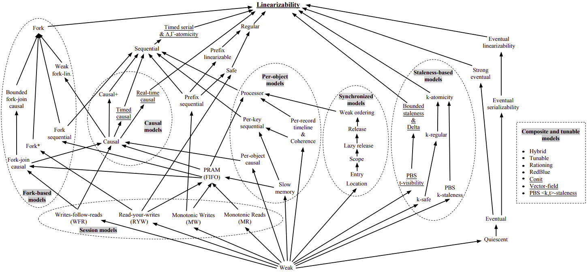

# Table of Contents

1.  [概述](#org7fbc783)
    1.  [设计、实施视角](#org5d1bb6f)
    2.  [观测的视角](#org21b6dbd)
2.  [次序一致性](#orgb3a7994)
    1.  [线性一致性 (linearizability)](#orga206061)
    2.  [顺序一致性 (sequential consistency)](#org014155b)
    3.  [因果一致性 (casual consistency)](#org2fb2128)
    4.  [会话保证 (session guarantees)](#org7b4232e)

# 概述

分布式系统的一致性模型从科研发展来说有两条脉络, 分别代表两种不同的视角, 一种是从系统设计、实施的视角, 另一种是从系统观测的视角。  

## 设计、实施视角

从设计、实施的视角出发, 需要对每种一致性问题的成因加以分析。 分布式系统中导致一致性问题可以分為两类, 一类是因事件、消息发生的 **次序** 引发的一致性问题。 按 Seth Gilbert 和 Nancy Lynch 于 2012 年 [Perspectives on the CAP Theorem](https://groups.csail.mit.edu/tds/papers/Gilbert/Brewer2.pdf) 中的分类, 这类服务于 weakly consistent services 和 simple services, 刻化这类只与次序有关的一致性模型统称為 **次序一致性** 。 另一类是為了追求高可用而持有多个数据复本, 而多复本之间同步的 **数据存储一致性**, 这一类是為了 **达成共识** 导致的一致性问题我们称為 **共识一致性**, **共识一致性** 由 Paxos 协议和 Raft 算法解决。  

**次序一致性** 与 **共识一致性** 分别对应了 CAP 定理中的 **C** 与 **A** 两个面向, 我们可以将这两种一致性合称為 **分布式一致性** 。 注意, 在 [Perspectives on the CAP Theorem](https://groups.csail.mit.edu/tds/papers/Gilbert/Brewer2.pdf) 中的分类中, 事务处理属于 complicated services, 被归类不属于 CAP 定理讨论的范畴, 这从设计、实施的角度来说是有必要的, 这是因為单节点 DBMS 本身就存在 **事务一致性** 问题 (ACID 中的 **C**), 该问题在分布式系统中会与 **分布式一致性** 发生耦合: **事务一致性** 与 **次序一致性** 耦合称為 **分布式事务读写一致性**; 而 **事务一致性** 与 **共识一致性** 耦合称為 **分布式事务存储一致性**, 这两种合称 **分布式事务一致性**, 分布式 DBMS 比起其他分布式系统需要更多的理论与设计。  

此现象从 Paolo Viotti 于 2016 年提出的 [Consistency in Non-Transactional Distributed Storage Systems](https://arxiv.org/pdf/1512.00168.pdf) 也可看到, 文中总结 50 多种 **次序一致性** 相关的一致性模型, 而这些都与事务处理无关的一致性模型; 因此分布式 DBMS 应该要如何应用 CAP 定理, 需要由分布式 DBMS 领域内部自己解决。  

本文会聚焦讨论 **次序一致性**, **共识一致性** 与 **分布式事务一致性** 在后续的章节讨论。  

## 观测的视角

从观测视角出发的意思是, 只从读请求的视角对于一致性做分类。 这种视角提出的一致性分类可以涵盖所有的分布式系统, 也包含分布式 DBMS。 这种视角的一致性根据强弱可以分為:  

-   弱一致性 (weak consistency)   
    当写请求成功后, 后续读请求可能读到, 也可能读不到。 比如搜索引擎的结果。
-   最终一致性 (eventually consistency)   
    当写请求成功后, 后续读请求可能读到, 也可能读不到, 但要求在指定时间内必须可以读到。 2008 年 Dan Pritchett, Ebay 在 ACM Queue 上发表 [Base: An Acid Alternative](https://queue.acm.org/detail.cfm?id=1394128). 主张在分布式数据库中放宽一致性约束, 求在指定时间之内必须达成一致, 这样的设计能够获得更好的可用性与水平扩展的能力。 从 CAP 定理的描述来说, 是追求可用性的 AP 模型。 BASE 模型的广泛认可, 这点对于提出 CAP 定理的 Brewer 是没预料到的, 当初 Brewer 认為 C 是相对于 A 来说更重要的属性。 另外, 2012 年由 Microsoft 发表的 [Eventually Consistent Transactions](https://citeseerx.ist.psu.edu/document?repid=rep1&type=pdf&doi=56ff564a9529842eb3db5c3b692ef92f03a588f8) 提供了实现最终一致性的理论和实施细节。
-   强一致性 (strong consistency)   
    当写请求成功后, 后续读请求能立即被读到。 从实施角度讨论外部一致性, 则外部一致性需要由 **Paxos 协议** 、 **Raft 算法** 保证 **共识一致性**, 并且要求每个写操作的顺序在分布式系统任意节点看到的都是一致的, 这就会要求分布式系统至少在 **次序一致性** 要达到 **线性一致性** 或 **顺序一致性** 的级别。 而对于分布式的 DBMS 而言, 為了支持事务而必须达到更强的 **严格可串行化**, 在论文 [Highly Available Transactions: Virtues and Limitations](https://amplab.cs.berkeley.edu/wp-content/uploads/2013/10/hat-vldb2014.pdf) 这种一致性称為 strong (or strict) one-copy consistency; 在论文 [Spanner: Google’s Globally-Distributed Database](https://perso.telecom-paristech.fr/kuznetso/INF346-2015/papers/spanner.pdf) 中也称為 external consistency 。

# 次序一致性

Paolo Viotti 于 2016 年提出的 [Consistency in Non-Transactional Distributed Storage Systems](https://arxiv.org/pdf/1512.00168.pdf) 对次序一致性模型做了全面、详尽的分类, 并且提供了形式化的定义, 以下是论文所有一致性模型之间的强弱关系图, 本文仅针对其中部份做讨论。  
  

所有的次序一致性模型, 实际上就是在发生事件构成的集合上构建一种 **有序关系** 。 我们可以理解為, 一致性模型之间的差异在于 **有序关系** 的强弱和约束。 **有序关系** 的分类有两种:  

-   **全序关系**  
    对于所有的事件, 要求达到每个事件都可以比较顺序。
-   **偏序关系**  
    对于所有的事件, 不要求达每个事件都可以比较顺序。

## 线性一致性 (linearizability)

最早由 CMU 的 Maurice P. Herlihy 和 Jeannette M. Wing 于 1987 年的 [Axioms for Concurrent Objects](http://www.cs.cmu.edu/~wing/publications/CMU-CS-86-154.pdf) 提出, 原文描述 **linearizability**:  

> linearizability can be defined as sequential consistency with the real-time constrain.  

**线性一致性 (linearizability)** 在所有的 **次序一致性** 中是最强的一致性, 它强调多个事件在系统中任意节点发生时, 从任意的节点进行读操作, 都必须得到一致的发生顺序。 因此, **线性一致性** 要求事件的发生顺序必须可以比较, 即要求对于所有的事件构成的集合达到 **全序关系**, 并且要求还必须满足 real-time 的约束。 在实现上, 分布式系统使用 **全局时钟** 技术来达到 **线性一致性** 。  

从分布式 DBMS 的产品层面看, 主流分布式 DBMS 大多也以实现线性一致性为目标, 在设计之初或演进过程中纷纷引入了全局时钟，比如 Spanner, TiDB, OceanBase, GoldenDB, 和巨杉等。  

## 顺序一致性 (sequential consistency)

**顺序一致性 (sequential consistency)** 是 **线性一致性 (linearizability)** 的弱化。 **顺序一致性 (sequential consistency)** 放宽了 **real-time** 的约束, 不要求某个事件发生立即可见, 但要求一旦某个事件被看见, 就要求该事件对所有节点可见, 这会造成最终所有的事件以相同的顺序被看见。  

以下满足 **顺序一致性**:  

<!-- This HTML table template is generated by emacs 28.2 -->
<table border="1">
  <tr>
    <td align="left" valign="top">
      &nbsp;time&nbsp;
    </td>
    <td align="left" valign="top">
      &nbsp;P1&nbsp;&nbsp;&nbsp;&nbsp;
    </td>
    <td align="left" valign="top">
      &nbsp;P2&nbsp;&nbsp;&nbsp;&nbsp;
    </td>
    <td align="left" valign="top">
      &nbsp;P3&nbsp;&nbsp;&nbsp;&nbsp;
    </td>
    <td align="left" valign="top">
      &nbsp;P4&nbsp;&nbsp;&nbsp;&nbsp;
    </td>
    <td align="left" valign="top">
      &nbsp;P5&nbsp;&nbsp;&nbsp;&nbsp;
    </td>
  </tr>
  <tr>
    <td align="left" valign="top">
      &nbsp;&nbsp;&nbsp;&nbsp;1&nbsp; 
      &nbsp;&nbsp;&nbsp;&nbsp;2&nbsp; 
      &nbsp;&nbsp;&nbsp;&nbsp;3&nbsp; 
      &nbsp;&nbsp;&nbsp;&nbsp;4&nbsp; 
      &nbsp;&nbsp;&nbsp;&nbsp;5&nbsp;
    </td>
    <td align="left" valign="top">
      &nbsp;W(x)a&nbsp; 
      &nbsp;&nbsp;&nbsp;&nbsp;&nbsp;&nbsp;&nbsp; 
      &nbsp;&nbsp;&nbsp;&nbsp;&nbsp;&nbsp;&nbsp; 
      &nbsp;&nbsp;&nbsp;&nbsp;&nbsp;&nbsp;&nbsp; 
      &nbsp;&nbsp;&nbsp;&nbsp;&nbsp;&nbsp;&nbsp;
    </td>
    <td align="left" valign="top">
      &nbsp;&nbsp;&nbsp;&nbsp;&nbsp;&nbsp;&nbsp; 
      &nbsp;W(x)b&nbsp; 
      &nbsp;&nbsp;&nbsp;&nbsp;&nbsp;&nbsp;&nbsp; 
      &nbsp;&nbsp;&nbsp;&nbsp;&nbsp;&nbsp;&nbsp; 
      &nbsp;&nbsp;&nbsp;&nbsp;&nbsp;&nbsp;&nbsp;
    </td>
    <td align="left" valign="top">
      &nbsp;&nbsp;&nbsp;&nbsp;&nbsp;&nbsp;&nbsp; 
      &nbsp;&nbsp;&nbsp;&nbsp;&nbsp;&nbsp;&nbsp; 
      &nbsp;R(x)b&nbsp; 
      &nbsp;R(x)a&nbsp; 
      &nbsp;&nbsp;&nbsp;&nbsp;&nbsp;&nbsp;&nbsp;
    </td>
    <td align="left" valign="top">
      &nbsp;&nbsp;&nbsp;&nbsp;&nbsp;&nbsp;&nbsp; 
      &nbsp;&nbsp;&nbsp;&nbsp;&nbsp;&nbsp;&nbsp; 
      &nbsp;&nbsp;&nbsp;&nbsp;&nbsp;&nbsp;&nbsp; 
      &nbsp;R(x)b&nbsp; 
      &nbsp;R(x)a&nbsp;
    </td>
    <td align="left" valign="top">
      &nbsp;&nbsp;&nbsp;&nbsp;&nbsp;&nbsp;&nbsp; 
      &nbsp;&nbsp;&nbsp;&nbsp;&nbsp;&nbsp;&nbsp; 
      &nbsp;&nbsp;&nbsp;&nbsp;&nbsp;&nbsp;&nbsp; 
      &nbsp;R(x)a&nbsp; 
      &nbsp;R(x)a&nbsp;
    </td>
  </tr>
</table>

> 虽然 P1 先于 P2 完成写入, 但是 P3 读出 <b, a>, 则其他的节点只能读出 <b, a> 或是 <a, a>  

**顺序一致性** 也是一种强一致性, 也同样要求事件集合达到 **全序关系**, 只是 **全序关系** 并不是受 **real-time** 条件的约束, 而是受 **事件观测顺序** 的约束。 以下引述自  [Consistency in Non-Transactional Distributed Storage Systems](https://arxiv.org/pdf/1512.00168.pdf):  

> Like linearizability, sequential consistency enforces a common global order of operations. Unlike linearizability, sequential consistency does not require real-time ordering of  
> operations across different sessions: only the real-time ordering of operations invoked by the same process is preserved (as in PRAM consistency).  

## 因果一致性 (casual consistency)

**因果一致性 (casual consistency)** 是 **顺序一致性 (sequential consistency)** 的弱化。 **因果一致性 (casual consistency)** 放宽了 **全序关系** 的约束, 只要求因果相关的事件需要以相同的顺序被看见。  
以下满足 **因果一致性**, 但不满足 **顺序一致性**:  

<!-- This HTML table template is generated by emacs 28.2 -->
<table border="1">
  <tr>
    <td align="left" valign="top">
      &nbsp;time&nbsp;
    </td>
    <td align="left" valign="top">
      &nbsp;P1&nbsp;&nbsp;&nbsp;&nbsp;
    </td>
    <td align="left" valign="top">
      &nbsp;P2&nbsp;&nbsp;&nbsp;&nbsp;
    </td>
    <td align="left" valign="top">
      &nbsp;P3&nbsp;&nbsp;&nbsp;&nbsp;
    </td>
    <td align="left" valign="top">
      &nbsp;P4&nbsp;&nbsp;&nbsp;&nbsp;
    </td>
  </tr>
  <tr>
    <td align="left" valign="top">
      &nbsp;&nbsp;&nbsp;&nbsp;1&nbsp; 
      &nbsp;&nbsp;&nbsp;&nbsp;2&nbsp; 
      &nbsp;&nbsp;&nbsp;&nbsp;3&nbsp; 
      &nbsp;&nbsp;&nbsp;&nbsp;4&nbsp; 
      &nbsp;&nbsp;&nbsp;&nbsp;5&nbsp; 
      &nbsp;&nbsp;&nbsp;&nbsp;6&nbsp;
    </td>
    <td align="left" valign="top">
      &nbsp;W(x)a&nbsp; 
      &nbsp;&nbsp;&nbsp;&nbsp;&nbsp;&nbsp;&nbsp; 
      &nbsp;&nbsp;&nbsp;&nbsp;&nbsp;&nbsp;&nbsp; 
      &nbsp;W(x)c&nbsp; 
      &nbsp;&nbsp;&nbsp;&nbsp;&nbsp;&nbsp;&nbsp; 
      &nbsp;&nbsp;&nbsp;&nbsp;&nbsp;&nbsp;&nbsp;
    </td>
    <td align="left" valign="top">
      &nbsp;&nbsp;&nbsp;&nbsp;&nbsp;&nbsp;&nbsp; 
      &nbsp;R(x)a&nbsp; 
      &nbsp;W(x)b&nbsp; 
      &nbsp;&nbsp;&nbsp;&nbsp;&nbsp;&nbsp;&nbsp; 
      &nbsp;&nbsp;&nbsp;&nbsp;&nbsp;&nbsp;&nbsp; 
      &nbsp;&nbsp;&nbsp;&nbsp;&nbsp;&nbsp;&nbsp;
    </td>
    <td align="left" valign="top">
      &nbsp;&nbsp;&nbsp;&nbsp;&nbsp;&nbsp;&nbsp; 
      &nbsp;R(x)a&nbsp; 
      &nbsp;&nbsp;&nbsp;&nbsp;&nbsp;&nbsp;&nbsp; 
      &nbsp;&nbsp;&nbsp;&nbsp;&nbsp;&nbsp;&nbsp; 
      &nbsp;R(x)b&nbsp; 
      &nbsp;R(x)c&nbsp;
    </td>
    <td align="left" valign="top">
      &nbsp;&nbsp;&nbsp;&nbsp;&nbsp;&nbsp;&nbsp; 
      &nbsp;R(x)a&nbsp; 
      &nbsp;&nbsp;&nbsp;&nbsp;&nbsp;&nbsp;&nbsp; 
      &nbsp;&nbsp;&nbsp;&nbsp;&nbsp;&nbsp;&nbsp; 
      &nbsp;R(x)c&nbsp; 
      &nbsp;R(x)b&nbsp;
    </td>
  </tr>
</table>

> P2 的 R(x)a, W(x)b 操作, 约束了事件必须以 <a, b> 的顺序被看见, 因為 b 是依赖于 a 的, 而 P3 的顺序是 <a, b, c>, P4 的顺序是 <a, c, b>, 不满足 **顺序一致性** 。  

## 会话保证 (session guarantees)

最早提出 **会话保证 (session guarantees)** 的是 1994 年的 [Session Guarantees for Weakly Consistent Replicated Data](https://www.researchgate.net/profile/Douglas-Terry-4/publication/3561300_Session_guarantees_for_weakly_consistent_replicated_data/links/02e7e52cdbe60a6cb4000000/Session-guarantees-for-weakly-consistent-replicated-data.pdf), 是一系列从用户 **读写操作** 对 **系统状态** 影响的约束模型, 这些一致性都弱于 **因果一致性 (casual consistency)** 。 文中除了提出定义之外也提供大量的场景描述, 有助于理解每种会话保证被提出的动机与价值。  
**会话保证 (session guarantees)** 有以下 4 种:  

-   **read your writes**  
    自己的写操作, 必须对自己可见。 这项约束的意义在于: 如果某个用户对于某个数据项进行更新 (相当于推动某个数据项的状态), 此后对于这个数据项, 该用户只能访问此状态当前或之后的状态。 比如, 我将相片同步至云相册, 这个同步操作可能需要多个节点持有复本, 但是我如果再次访问云相册时, 我可以看见我上传的相片, 换句话说, 只能访问已经完成同步的节点。
-   **monotonic read**  
    如果已经读到某个数据的状态, 此后对于此数据, 不能看到过去的状态。 这项约束的意义在于: 一旦用户对某个数据状态被读取, 该数据状态就必须生效, 不能再读到过去的状态。
-   **write follow read**  
    如果已经读到某个数据状态, 此后对于此数据, 不能更新比该状态更早的数据复本。
-   **monotonic write**  
    要求在同一会话中, 对同一数据复本上的写请求的实施, 必须是单调有序的。 比如, 某个用户连续更改密码两次, 系统实施两次更新必须依照用户提交的顺序, 并且对所有的数据复本都必须如此。

