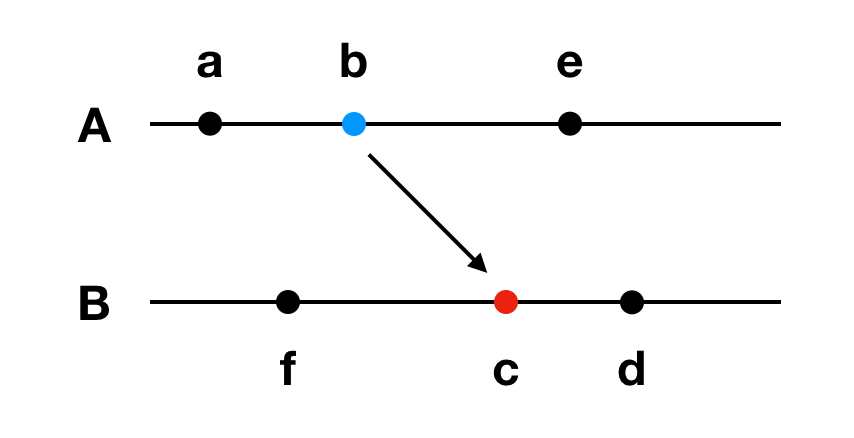
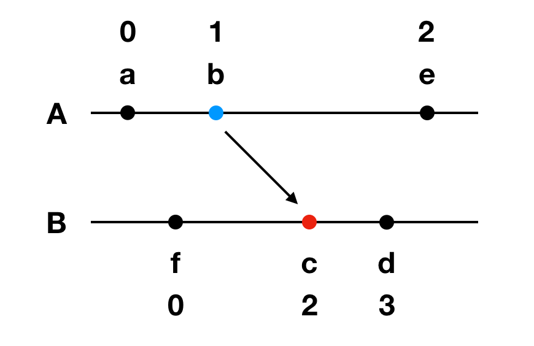

# Table of Contents

1.  [概述](#org70c945b)
2.  [Lamport 逻辑时钟 (Lamport Logical Clock)](#orgf5c8675)
    1.  [事件的 happened-before 关系](#org46ce96c)
    2.  [Lamport 时钟算法](#org5a54792)
    3.  [Lamport 时钟算法的局限](#org841923d)
3.  [向量时钟 (Vector Clock)](#orgc9e2a16)
    1.  [向量时钟算法](#org3d3480b)
    2.  [因果一致性的证明](#orgc16fb5b)
4.  [混合逻辑时钟 (Hybrid Logical Clock)](#orgb364410)
5.  [References](#orga915b46)

# 概述

上文我们提到: 分布式系统中 **次序一致性** 模型之间的差异在于 **有序关系** 的强弱与约束。 要确定事件集合的 **有序关系** 是透过实现一个 **时钟机制**, 透过时钟产生的 timestamp 来确定事件的发生顺序。 本文将介绍分布式系统中实现这些 **次序一致性** 模型的时钟算法。 首先, 我们先从全局上鸟瞰一下所有的时钟机制:  

-   不可靠的物理时钟  
    物理时钟是一种硬件设备, 也称为系统时钟或实时时钟 (RTC)。 物理时钟内部有个晶体, 物理时钟通过计算晶体的振荡频率来驱动一个计数器, 该计数器以固定的时间间隔递增时钟值。 假设这个时间值就是 timestamp, 在单机环境下, 所有的事件透过比较彼此的 timestamp 大小, 即可确定事件的发生顺序, **有序关系** 从而得到保证。  
    
    但在分布式系统中, 会由于每台机器物理时钟的晶体振荡频率不同, 所以每台机器的计数器的更新频率也不同。 因此不同节点发生事件的是不可比较的。 这个现象直观的理解就是: 每个时钟有快有慢, 如果每个节点不是依赖某个唯一的物理时钟所产生的时间值做為 timestamp, 则不同节点之间的事件的先后关系是无法比较的。
-   **Network Time Protocol (NTP)** 协议  
    David L. Mills 于 1985 年提出了 **Network Time Protocol (NTP)**, 其思想是: 在系统中维护一个高精度的物理时钟, 其他时钟向该时钟进行校准。 虽然 NTP 是可靠的, 但是延迟和误差太高, 后续并没有单独使用 NTP 的系统。
-   **Lamport 逻辑时钟 (Lamport Logical Clock)**  
    Leslie Lamport 于 1978 年于 [Time, clocks, and the ordering of events in a distributed system](https://www.eecs.ucf.edu/~lboloni/Teaching/COP5611_2008/slides/clock-lamport.pdf) 最早提出 **逻辑时钟** 的概念。 Lamport 在论文中定义了 **因果模型**, 并且认為他提出的罗即时中算法可以保证 **因果模型** 。 但实际上 Lamport 逻辑时钟不能保证 **因果一致性 (casual consistency)**, 这是因為其他没参与通信的节点无法感知到其他参与通信节点的因果律, 我们后续会证明这一点。
-   **向量时钟 (Vector Clock)**  
    **向量时钟 (Vector Clock)** 是基于 **Lamport 逻辑时钟** 提出的修正, 于 1988 年由 Friedemann Mattern 在 [Virtual Time and Global States of Distributed Systems](https://sites.cs.ucsb.edu/~arch/spr07-seminar/papers/VirtTimeGlobStates-89.pdf) 被提出。 其主要的改进在于, **向量时钟** 找到一种能够发布已经被确定的因果关系的方式, 使其他没有参与通信的节点也能感知道。 我们后续会证明 **向量时钟** 能确保 **因果一致性** 。
-   **混合逻辑时钟 (Hybrid Logical Clock)**  
    2014 年, Sandeep S. Kulkarni 等人于 [Logical Physical Clocks](https://citeseerx.ist.psu.edu/document?repid=rep1&type=pdf&doi=cea6a30d755ddc145bc886a9cb733c81c77b6568) 提出了 **混合逻辑时钟 (Hybrid Logical Clock, HLC)**, 其透过结合物理时钟与向量时钟, 来确定所有事件的先后关系, **全序关系** 从而得到保证。

# Lamport 逻辑时钟 (Lamport Logical Clock)

物理时钟不可靠的原因在于: 每个时钟有快有慢, 如果每个节点不是依赖某个唯一的物理时钟所产生的时间值做為 timestamp, 则不同节点之间的事件的先后关系是无法比较的。 而 Lamport 提出的想法是:  

1.  在同一进程中发生的事件, 可以确定先后关系。
2.  发生通信的事件, 可以确定先后关系。
3.  对于其他事件, 属于并发事件, 无法确定先后关系。

## 事件的 happened-before 关系

$$ a, b, c,... \in S $$, $$ a $$ **happened-before** $$ b $$ 记作 $$ a \rightarrow b $$:  

1.  $$ a $$, $$ b $$ 属于同一个进程, 且 a 比 b 先发生, 则 $$ a \rightarrow b $$
2.  $$ a $$, $$ b $$ 属于不同个进程, 但 $$ a $$ 是 &ldquo;发送事件&rdquo;, $$ b $$ 是 &ldquo;接收事件&rdquo;, 则 $$ a \rightarrow b $$
3.  如果 $$ a \rightarrow b $$ 且 $$ b \rightarrow c $$, 则 $$ a \rightarrow c $$
4.  如果 $$ a \nrightarrow b $$ 且 $$ b \nrightarrow a $$, 则 $$ a \perp b $$, 称為并发事件

比如, 以下情况:  
  

> 1.  $$ a \rightarrow b \rightarrow c \rightarrow d $$
> 2.  $$ a \perp f $$, 且 $$ e \perp d $$

## Lamport 时钟算法

$$ P_{i} $$ 表示某进程, $$ C_{i} $$ 表示某进程 $$ P_{i} $$ 的本地时间值, 某个进程的事件 $$ a $$ 的 timestamp 表示為 $$ C_{i} (a) $$:  

1.  $$ P_{i} $$ 每次发生一个事件, $$ C_{i} = C_{i} + 1$$
2.  $$ P_{i} $$ 发送消息给 $$ P_{j} $$ 时, 需要发送 $$ C_{i} $$
3.  $$ P_{j} $$ 收到消息时, 更新 $$ C_{j} $$ 為 $$ C_{j} = max \{C_{i}, C_{j}\} + 1$$

根据 **happened-before** 关系, 我们可以有定理:  
$$ a \rightarrow b \Rightarrow C_{i}(a) < C_{j}(b)$$  

但反方向不成立:  
$$ C_{i}(a) < C_{j}(b) \nRightarrow  a \rightarrow b $$  

证明:  
  
$$ C_{A}(e) < C_{B}(d) $$, 但 $$ e \perp d $$  

## Lamport 时钟算法的局限

论文中 Lamport 也有提到 $$ C_{i}(a) < C_{j}(b) \nRightarrow  a \rightarrow b $$ 的问题, 而这个问题直接说明 Lamport 逻辑时钟无法满足 **因果一致性** 。  
我们考虑以下案例, 此案例满足 **因果一致性**:  

<!-- This HTML table template is generated by emacs 28.2 -->
<table border="1">
  <tr>
    <td align="left" valign="top">
      &nbsp;time&nbsp;
    </td>
    <td align="left" valign="top">
      &nbsp;P1&nbsp;&nbsp;&nbsp;&nbsp;
    </td>
    <td align="left" valign="top">
      &nbsp;P2&nbsp;&nbsp;&nbsp;&nbsp;
    </td>
    <td align="left" valign="top">
      &nbsp;P3&nbsp;&nbsp;&nbsp;&nbsp;
    </td>
    <td align="left" valign="top">
      &nbsp;P4&nbsp;&nbsp;&nbsp;&nbsp;
    </td>
  </tr>
  <tr>
    <td align="left" valign="top">
      &nbsp;&nbsp;&nbsp;&nbsp;1&nbsp; 
      &nbsp;&nbsp;&nbsp;&nbsp;2&nbsp; 
      &nbsp;&nbsp;&nbsp;&nbsp;3&nbsp; 
      &nbsp;&nbsp;&nbsp;&nbsp;4&nbsp; 
      &nbsp;&nbsp;&nbsp;&nbsp;5&nbsp; 
      &nbsp;&nbsp;&nbsp;&nbsp;6&nbsp;
    </td>
    <td align="left" valign="top">
      &nbsp;W(x)a&nbsp; 
      &nbsp;&nbsp;&nbsp;&nbsp;&nbsp;&nbsp;&nbsp; 
      &nbsp;&nbsp;&nbsp;&nbsp;&nbsp;&nbsp;&nbsp; 
      &nbsp;W(x)c&nbsp; 
      &nbsp;&nbsp;&nbsp;&nbsp;&nbsp;&nbsp;&nbsp; 
      &nbsp;&nbsp;&nbsp;&nbsp;&nbsp;&nbsp;&nbsp;
    </td>
    <td align="left" valign="top">
      &nbsp;&nbsp;&nbsp;&nbsp;&nbsp;&nbsp;&nbsp; 
      &nbsp;R(x)a&nbsp; 
      &nbsp;W(x)b&nbsp; 
      &nbsp;&nbsp;&nbsp;&nbsp;&nbsp;&nbsp;&nbsp; 
      &nbsp;&nbsp;&nbsp;&nbsp;&nbsp;&nbsp;&nbsp; 
      &nbsp;&nbsp;&nbsp;&nbsp;&nbsp;&nbsp;&nbsp;
    </td>
    <td align="left" valign="top">
      &nbsp;&nbsp;&nbsp;&nbsp;&nbsp;&nbsp;&nbsp; 
      &nbsp;R(x)a&nbsp; 
      &nbsp;&nbsp;&nbsp;&nbsp;&nbsp;&nbsp;&nbsp; 
      &nbsp;&nbsp;&nbsp;&nbsp;&nbsp;&nbsp;&nbsp; 
      &nbsp;R(x)b&nbsp; 
      &nbsp;R(x)c&nbsp;
    </td>
    <td align="left" valign="top">
      &nbsp;&nbsp;&nbsp;&nbsp;&nbsp;&nbsp;&nbsp; 
      &nbsp;R(x)a&nbsp; 
      &nbsp;&nbsp;&nbsp;&nbsp;&nbsp;&nbsp;&nbsp; 
      &nbsp;&nbsp;&nbsp;&nbsp;&nbsp;&nbsp;&nbsp; 
      &nbsp;R(x)c&nbsp; 
      &nbsp;R(x)b&nbsp;
    </td>
  </tr>
</table>

 **因果一致性** 要能够保证, 要能保证 $$ P_{3} $$, $$ P_{4} $$ 能够感知到 $$ P_{1} $$, $$ P_{2} $$ 已经建立好的有序关系, 也就是说 **有序关系** 要被跨进程发布才行。  
也就是说要保证 **因果一致性**, 以下两件事情要成立:  

1.  $$ a \rightarrow b \Rightarrow C_{i}(a) < C_{j}(b)$$
2.  $$ a \rightarrow b \Leftarrow C_{i}(a) < C_{j}(b)$$

也就是说, **因果一致性** 是一个等价关系:  
$$ a \rightarrow b \Leftrightarrow C_{i}(a) < C_{j}(b)$$  

# 向量时钟 (Vector Clock)

**向量时钟 (Vector Clock)** 是 1988 年由 Colin Fidge 和 Friedemann Mattern 在 Lamport 逻辑时钟基础上提出的。  

## 向量时钟算法

向量时钟算法与 Lamport 时钟算法的思路一致, 区别在于多传了一些信息。  
对于每个进程 $$ P_{i} $$, 定义时间向量 $$ VC_{i} $$, 向量维度是 $$ n $$, 同时是进程数。  

1.  初始化时, $$ VC_{i} $$ 全部為零, 即 $$ VC_{i} = [0,...,0] $$
2.  $$ P_{i} $$ 进程内发生事件时, 该维度的时间值递增, 即 $$ VC_{i}[i] = VC_{i}[i] + 1 $$, (注: 初始化完毕视為一事件)
3.  $$ P_{i} $$ 进程发送消息给 $$ P_{j} $$ 时, 需要附带 $$ VC_{i} $$
4.  $$ P_{j} $$ 收到 $$ P_{i} $$ 的消息时, 透过  $$ VC_{i} $$ 更新自己的时间向量 $$ VC_{j} $$, 分為两步骤:  
    1.  对齐, $$ \forall k \in [1, n] $$, 使得 $$ VC_{j}[k] = max \{ VC_{i}[k], VC_{j}[k]\} $$
    2.  自增, $$ VC_{j}[j] = VC_{j}[j] + 1 $$

我们可以观察到, Lamport 时钟算法在通信发生时, 只对齐通信两端的逻辑时钟; 而向量时钟算发是在通信发生时对齐双方感知道的整个系统。  

根据以上算法, 我们定义以下关系:  

1.  $$ VC_{i} = VC_{j} \Leftrightarrow VC_{i}[k] = VC_{j}[k], \forall k \in [1, n] $$
2.  $$ VC_{i} \le VC_{j} \Leftrightarrow VC_{i}[k] \le VC_{j}[k], \forall k \in [1, n] $$

然后, 我们定义两个时间向量的严格小于:  
$$ VC_{i} < VC_{j} \Leftrightarrow $$  

1.  $$ VC_{i} \le VC_{j} $$
2.  $$ \exists k \in [1, n], \ni VC_{i}[k] < VC_{j}[k] $$

最后我们会有以下定理, 即 **因果一致性**:  
$$ VC_{i}(a) < VC_{j}(b) \Leftrightarrow a \rightarrow b $$  

## 因果一致性的证明

$$ a \rightarrow b \Rightarrow VC_{i}(a) < VC_{j}(b) $$ 是显然的, 我们只需讨论 $$ VC_{i}(a) < VC_{j}(b) \Rightarrow a \rightarrow b $$:  

1.  $$ a $$, $$ b $$ 属于相同进程, 则 $$ a \rightarrow b $$ 是显然的
2.  $$ a $$, $$ b $$ 属于不同进程, $$ a $$ 為发送事件, $$ b $$ 為接收事件, 则 $$ a \rightarrow b $$ 是显然的

需要讨论的情况是, $$ a $$, $$ b $$ 属于不同进程, 且至少其中一个不為通信事件:  

1.  其中之一是通信事件, 不失一般性假设 $$ a $$ 不為通信事件, 则存在事件 $$ c $$ 与 $$ b $$ 发生通信  
    若 $$ a \rightarrow c $$, 由于 $$ c \rightarrow b $$, 根据递移性, $$ a \rightarrow b $$
2.  两者接不為通信事件, 则存在 则存在事件 $$ c $$, $$ d $$ 发生通信, 不失一般性假设 $$ c $$ 為发送事件, $$ d $$ 為接收事件  
    若 $$ a \rightarrow c $$, $$ d \rightarrow b $$, 根据递移性, $$ a \rightarrow b $$

# 混合逻辑时钟 (Hybrid Logical Clock)

# References

<https://writings.sh/post/logical-clocks>  
<http://yang.observer/2020/07/26/time-lamport-logical-time/>  

<https://orgmode.org/worg/org-symbols.html>  

